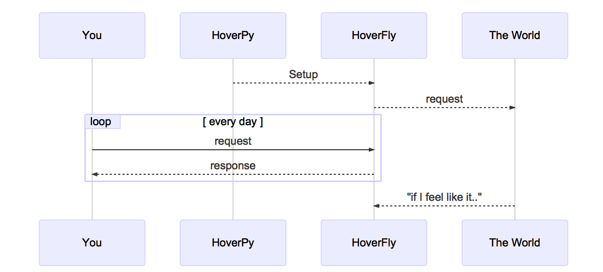
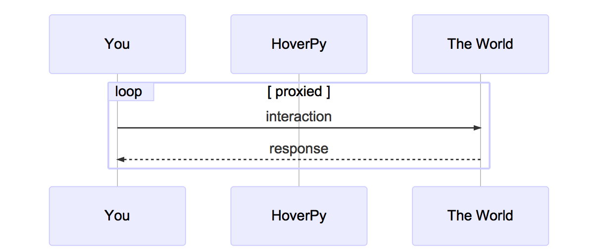
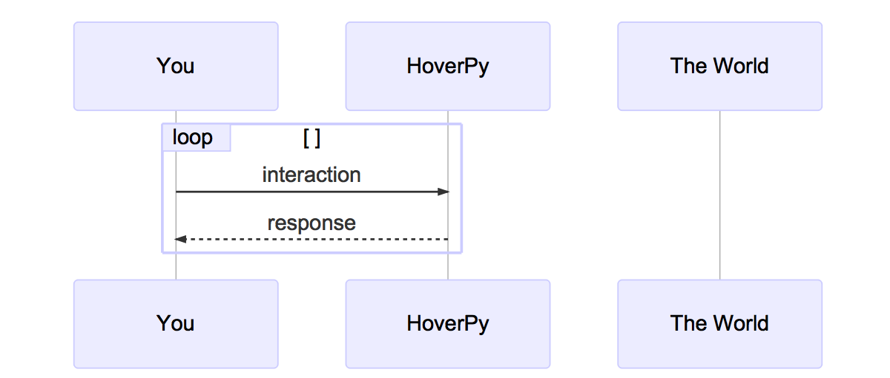
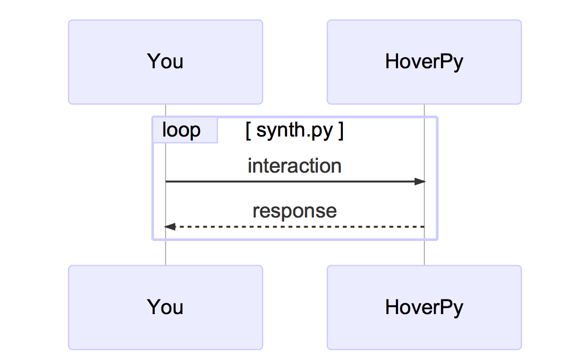
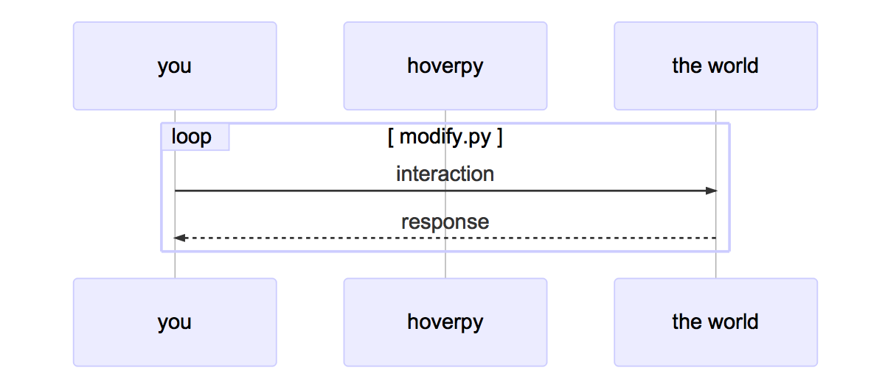

Introduction
============

Building and testing interdependent applications is difficult. Maybe
you’re building a mobile application that needs to talk to a legacy API.
Or a microservice that relies on two other services that are still in
development The problem is the same: how do you develop and test against
external dependencies which you cannot control?

You could use mocking libraries as substitutes for external
dependencies. But mocks are intrusive, and do not test all the way to
the architectural boundary of your application. This means the client
code for your external dependency is substituted and not tested.

Stub services are better, but they often involve too much configuration
or may not be transparent to your application. Then there is the problem
of managing test data. Often, to write proper tests, you need
fine-grained control over the data in your mocks or stubs. Managing test
data across large projects with multiple teams introduces bottlenecks
that impact delivery times.

Integration testing “over the wire” is problematic too. When stubs or
mocks are substituted for real services (in a continuous integration
environment for example) new variables are introduced. Network latency
and random outages can cause integration tests to fail unexpectedly.

Service Virtualisation is software that records the interactions between
*you*, and the *big unpredictible world*.

.. figure:: mermaid/intro/graph1.png
   :alt: hoverpy intro image1

A very sturdy software solution for Service Virtualisation is
`Mirage <https://github.com/SpectoLabs/mirage>`__, which is used
extensively in the airline industry. Its successor,
`HoverFly <http://hoverfly.io>`__, has taken all the lessons learned in
the years of use of Mirage. Both Mirage and Hoverfly are open source
software, developed at `specto.io <http://spectio.io>`__.

HoverPy is the thin layer between Python and HoverFly. HoverFly is a
light-weight and extremely fast proxy written in Go, and does the heavy
lifting for HoverPy. So a more accurate picture might be:

--------------

Feature overview
----------------

-  “Capture” traffic between a client and a server application
-  Use captured traffic to simulate the server application
-  Export captured service data as a JSON file
-  Import service data JSON files
-  Simulate latency by specifying delays which can be applied to
   individual URLs based on regex patterns, or based on HTTP method
-  Flexible request matching using templates
-  Supports “middleware” (which can be written in any language) to
   manipulate data in requests or responses, or to simulate unexpected
   behaviour such as malformed responses or random errors
-  Supports local or remote middleware execution (for example on AWS
   Lambda)
-  Uses BoltDB to persist data in a binary file on disk - so no
   additional database is required
-  REST API
-  Run as a transparent proxy or as a webserver
-  High performance with minimal overhead
-  JUnit rule “wrapper” is available as a Maven dependency
-  Supports HTTPS and can generate certificates if required
-  Authentication (combination of Basic Auth and JWT)
-  Admin UI to change state and view basic metrics

Use cases
---------

Hoverfly is designed to cater for two high-level use cases. Capturing
real HTTP(S) traffic between an application and an external service for
re-use in testing or development.

If the external service you want to simulate already exists, you can put
Hoverfly in between your client application and the external service.
Hoverfly can then capture every request from the client application and
every matching response from the external service (capture mode).

These request/response pairs are persisted in Hoverfly, and can be
exported to a service data JSON file. The service data file can be
stored elsewhere (a Git repository, for example), modified as required,
then imported back into Hoverfly (or into another Hoverfly instance).

Hoverfly can then act as a “surrogate” for the external service,
returning a matched response for every request it received (simulate
mode). This is useful if you want to create a portable, self-contained
version of an external service to develop and test against.

This could allow you to get around the problem of rate-limiting (which
can be frustrating when working with a public API) You can write
Hoverfly extensions to manipulate the data in pre-recorded responses, or
to simulate network latency.

You could work while offline, or you could speed up your workflow by
replacing a slow dependency with a fast Hoverfly “surrogate”.

Creating simulated services for use in a testing or development.
----------------------------------------------------------------

In some cases, the external service you want to simulate might not exist
yet. You can create service simulations by writing service data JSON
files. This is in line with the principle of design by contract
development. Service data files can be created by each developer, then
stored in a Git repository. Other developers can then import the service
data directly from the repository URL, providing them with a Hoverfly
“surrogate” to work with. Instead of writing a service data file, you
could write a “middleware” script for Hoverfly that generates a response
“on the fly”, based on the request it receives (synthesize mode). More
information on this use-case is available here: Synthetic service
example Easy API simulation with the Hoverfly JUnit rule Proceed to the
“Modes” and middleware section to understand how Hoverfly is used in
these contexts.

--------------

Modes and middleware
--------------------

Hoverfly modes
~~~~~~~~~~~~~~

Hoverfly has four modes. Detailed guides on how to use these modes are
available in the Usage section.

Capture mode
^^^^^^^^^^^^

In this mode, Hoverfly acts as a proxy between the client application
and the external service. It transparently intercepts and stores
outgoing requests from the client and matching incoming responses from
the external service. This is how you capture real traffic for use in
development or testing.

Simulate mode
^^^^^^^^^^^^^

In this mode, Hoverfly uses either previously captured traffic, or
imported service data files to mimic the external service. This is
useful if you are developing or testing an application that needs to
talk to an external service that you don’t have reliable access to. You
can use the Hoverfly “surrogate” instead of the real service.

Synthesize mode
^^^^^^^^^^^^^^^

In this mode, Hoverfly doesn’t use any stored request/response pairs.
Instead, it generates responses to incoming requests on the fly and
returns them to the client. This mode is dependent on middleware (see
below) to generate the responses.

This is useful if you can’t (or don’t want to) capture real traffic, or
if you don’t want to write service data files.

Modify mode
^^^^^^^^^^^

In this mode, Hoverfly passes requests through from to the server, and
passes the responses back. However, it also executes middleware on the
requests and responses. This is useful for all kinds of things such as
manipulating the data in requests and/or responses on the fly.

Middleware
----------

Middleware can be written in any language, as long as that language is
supported by the Hoverfly host. For example, you could write middleware
in Go, Python or JavaScript (if you have Go, Python or NodeJS installed
on the Hoverfly host, respectively).

Middleware is applied to the requests and/or the responses depending on
the mode:

-  Capture Mode: middleware affects only outgoing requests
-  Simulate Mode: middleware affects only responses (cache contents
   remain untouched)
-  Synthesize Mode: middleware creates responses
-  Modify Mode: middleware affects requests and responses
-  Middleware can be used to do many useful things, such as simulating
   network latency or failure, rate limits or controlling data in
   requests and responses.

A detailed guide on how to use middleware is available in the Usage
section.
